# Visual Studio Code 
 

I think being a programmer who must know how to use the debug tool whatever who uses what kind of code editor or IDE.  If we know how to use the debug tool, it can enhance our coding efficiency. I think you guys already understood what I mean.  

## Debug mode tutorials

First, we can press **F5** to start debugging mode or you can also find it on here.

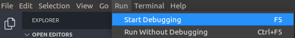

After we start debugging mode, it will appear a small control board.

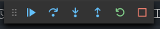

Of course, it seems to happen nothing and running as normal because we haven't flag lines what we wanna track.

Hence, before we start debugging mode, let's flag some lines that we can see the number near by our codes. We just click it and it will display the "red dot" (i.e., Breakpoints). It means that you wanna check this line during using debugging.

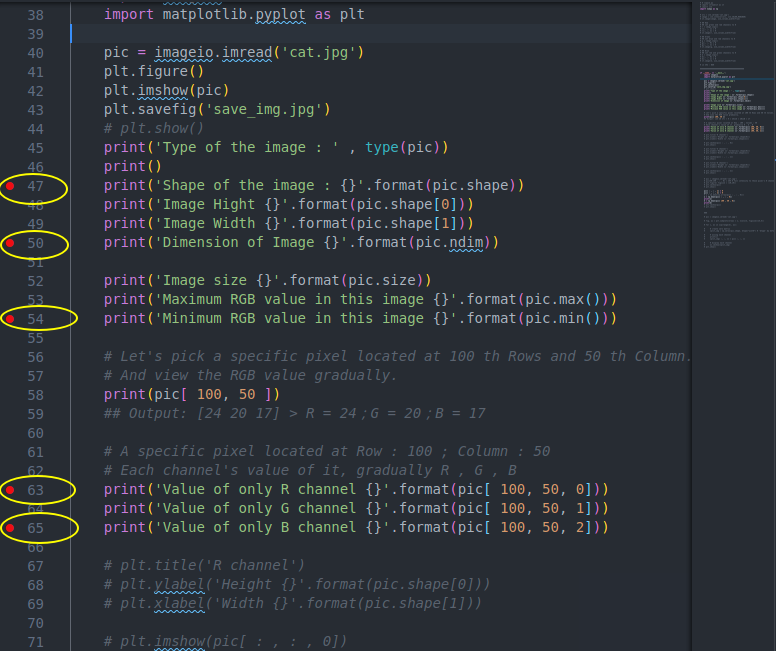

Suppose we flag 5 dots and press F5 again, and then it is going to check the lines of what you flag.

### Introduction of buttons

Next, we are going to introduce those buttons meaning to teach you how to use them.

| Icon | Name | Description     |
| ---- | ---- | ---- |
|  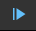    | Continue | When you start debugging mode, it will go to the first dot, and then you can press this button that it will jump to the second dot directly.   |
|  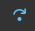    | Step Over | This button will run line by line. For example, first dot is at line 47. When you press it, it will go to line 48.    |
|  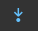    | Step Info | Step Info is a little bit different with Step Over. Step Info will go into the function (e.g., definition) if there is a function inside in that line. For example, you have A and B scripts, and A needs to call the definition from B. When you implement on that definition in A script, it will go into the definition of B script. Also, when it goes to a for loop, it will also bring you into that for loop.  |
|  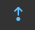    | Step Out | According to last example, when you go into B script, you can press this button to go back to the A script.  |
|  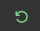    | Restart | You don't need to leave the debugging mode and press F5 again. You can directly press this button to run again.     |
|  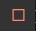    | Stop | Stop / leave debugging mode.     |

### Introduction of debug console

Sequentially, debug console is also a quite important part. When we start debugging mode, how can we track the variables? Use it, debug console.

First step, open the terminal and choose the "DEBUG CONSOLE".

PS if you haven't started debugging mode, you cannot use it.
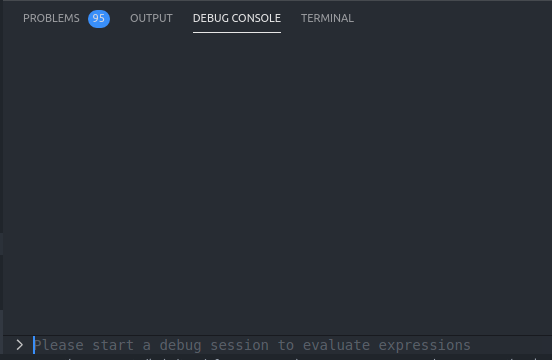

OK. Go ahead. 

Let's see my example.
Suppose I wanna check this variable of `a` to see its value. 
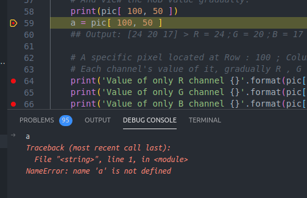
When I typed `a`, I got the error because it hasn't passed this line. It hasn't implemented this line.

Hence, we run into next line and type again.
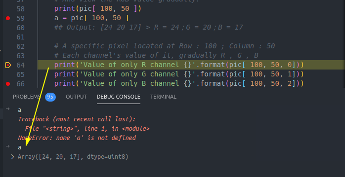
See. We can get the value of variable `a`.

Of course, we can see more detail about this variable from "debug area" on the sidebar.

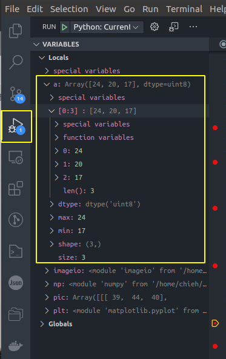

Expand the `a` and then we can see there are more detail information of variable `a`. I deeply believe that sometimes these information is quite helpful.